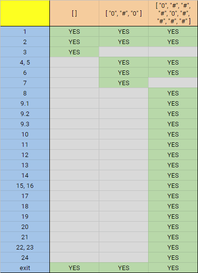
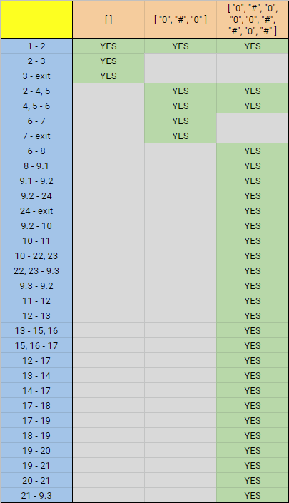

# SI_2025_lab2_233153
Hristijan Iliev 233153

# Цикломатска комплексност

Цикломатската комплексност е дефинирана со V(G) = E - N + 2, каде што E е број на ребра и N е број на јазли на CFG.

V(G) = 31 - 24 + 2 = 9

Цикломатската комплексност на кодот изнесува 9.

# Тест случаи според Every Statement критериумот

# Тест случаи според Every Branch критериумот

# Објаснување за напишаните тестови
Има 4 тестови:

1) list = [ ]
	Се праќа празна листа и се очекува програмата да фрли IllegalArgumentException. Овој тест се користи кај двата критериуми.
2) list = [ "0", "#", "0" ]
	Се праќа листа со неквадратна големина и се очекува програмата да фрли IllegalArgumentException. Овој тест се користи кај двата критериуми.
3) list = [ "0", "#", "#", "#", "0", "#", "#", "#", "#" ]
	Се праќа непразна листа со квадратна големина и се очекува да завршви програмата и да врати резултат [ "2", "#", "#", "#", "4", "#", "#", "#", "#" ]. Овој тест се користи кај Every Statement критериумот.
4) list = [ "0", "#", "0", "0", "0", "#", "#", "0", "#" ]
	Се праќа непразна листа со квадратна големина и се очекува да завршви програмата и да врати резултат [ "1", "#", "2", "1", "2", "#", "#", "2", "#" ]. Овој тест се користи кај Every Branch критериумот.
